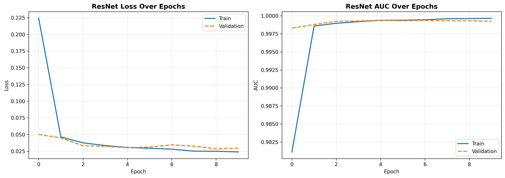
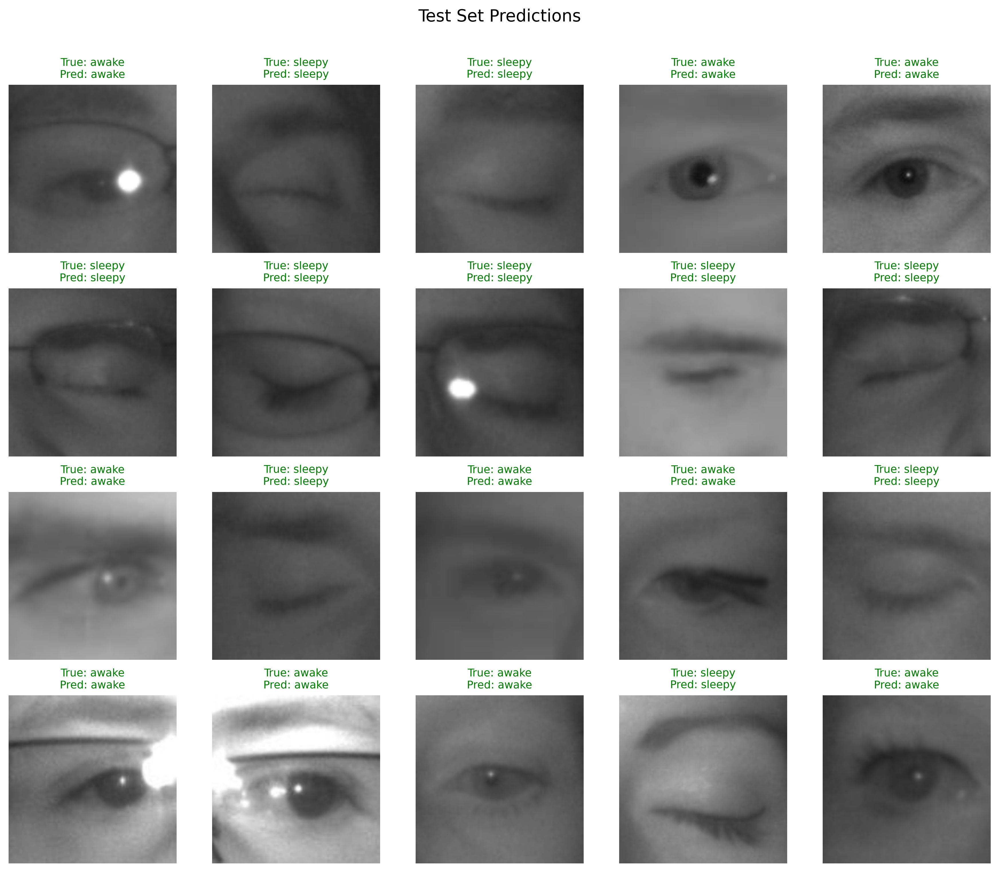
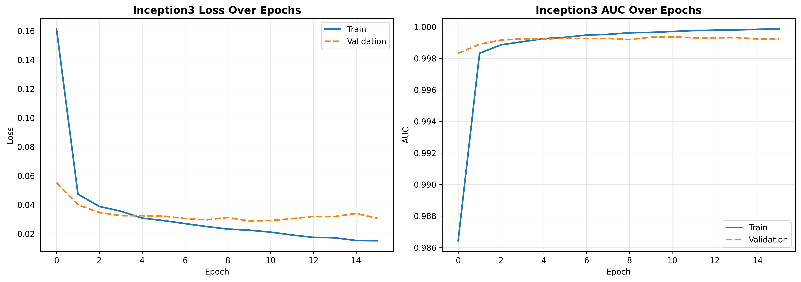
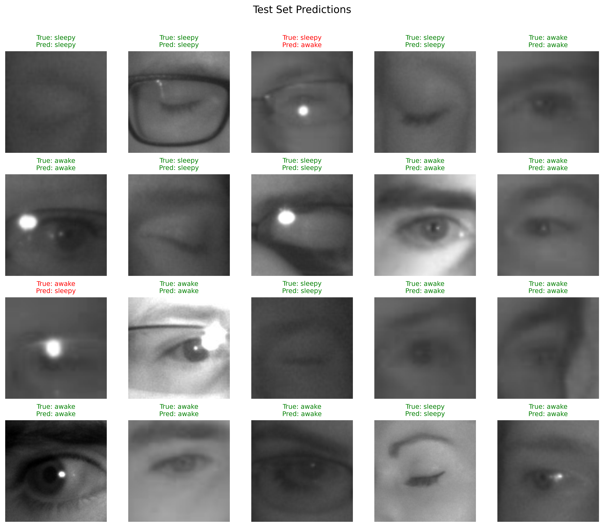

# Drowsiness Detection — Eye State Classification

Binary classification of infrared eye images into **Awake** and **Sleepy** states using transfer learning on the MRL Eye Dataset (~85K images).

---

## Overview

Driver drowsiness is one of the leading causes of road accidents. This project builds a deep learning classifier that detects eye state (open vs. closed) from infrared images — a core component of any real-time drowsiness detection system.

Two pretrained models are fine-tuned and compared:

| Model | Epochs | Val AUC |
|---|---|---|
| ResNet50 | 10 | ~0.9997 |
| InceptionV3 | 15 | ~0.9993 |

Both models converge fast and generalize well, with train/val loss tracking closely — no significant overfitting.

---

## Dataset

**MRL Eye Dataset** (Forked Version) — infrared eye images labeled as Awake or Sleepy.

| Split | Awake | Sleepy | Total |
|---|---|---|---|
| Train | 25,770 | 25,167 | 50,937 |
| Validation | 8,591 | 8,389 | 16,980 |
| Test | 8,591 | 8,390 | 16,981 |

- 37 subjects · multiple sensors · various lighting conditions  
- Classes are well-balanced — no resampling needed  

Dataset source: [mrl.cs.vsb.cz/eyedataset](http://mrl.cs.vsb.cz/eyedataset)

Expected directory structure:

```
data/
├── train/
│   ├── awake/
│   └── sleepy/
├── val/
│   ├── awake/
│   └── sleepy/
└── test/
    ├── awake/
    └── sleepy/
```

---

## Approach

**Why transfer learning?**  
Even with ~85K images, pretrained weights (ImageNet) provide low-level features — edges, textures, shapes — that transfer well to infrared eye images and cut training time significantly.

**Augmentation**  
Light augmentation on train only: Gaussian blur, brightness jitter, horizontal flip, random rotation. The dataset is large enough that heavy augmentation isn't necessary.

---

## Results

### ResNet50





### InceptionV3





Both models reach **AUC > 0.999** on the validation set. The few misclassified examples (shown in red) are edge cases — heavily shadowed eyes, glare artifacts, or partially closed eyelids that are ambiguous even to a human.

---

## Project Structure

```
├── Drowsiness_Detection.ipynb   # full pipeline: EDA → training → evaluation
├── ResNet_AUC_LOSS_Curves.png
├── ResNet_test_set_predictions.png
├── Inception3_AUC_LOSS_Curves.png
├── Inception3_test_set_predictions.png
└── README.md
```

---

## Setup

```bash
pip install torch torchvision scikit-learn tqdm seaborn matplotlib
```

Update the dataset paths in the **Configuration** cell of the notebook, then run all cells top to bottom.

---

## Key Design Decisions

- **AdamW optimizer** with a low learning rate (1e-5) to avoid destroying pretrained weights early in training  
- **Early stopping** on validation AUC with patience=5 to prevent overfitting  
- **Mixed precision** (`torch.autocast`) for faster GPU training  
- **Dropout(0.5)** added before the ResNet head as a light regularizer  
- Grayscale conversion applied *after* augmentation to preserve color-based jitter effects before discarding color

---

## References

- Fusek, R. (2018). *Pupil localization using geodesic distance.* ICIAR 2018. [[paper]](http://mrl.cs.vsb.cz/people/fusek/)  
- MRL Eye Dataset: [http://mrl.cs.vsb.cz/eyedataset](http://mrl.cs.vsb.cz/eyedataset)